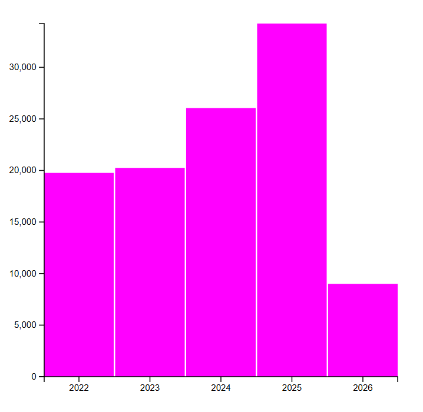

# Description
This is the first visual I a have made with D3. This was with a .js file which I used the example we used in class almost like a template so I can start to show the clean data that I used in the past. I decided to change the color and to be able to format the x and y axis.

## D3 Demo

  

