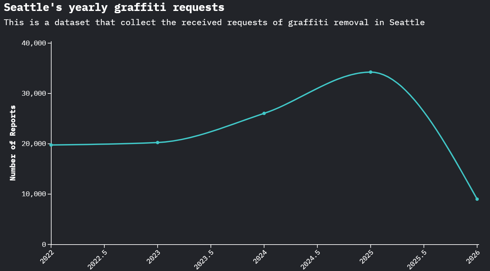

# Description
This is a visual that was made with the data set that shows daily requests to the city on graffiti, This data came from Stephen Barham which is a public data set that is updated daily. I decided to use the same dataset which I cleaned previously because this is able to dataset is able to show "anomalies" this being the random drop that occurs through out the year of 2025, there was steady rise that was occurring throughout the years recorded which maybe the trend would keep ongoing but a drop occurred mid way through 2025. With 2026 just starting maybe the spike will adjust to the trend we have been seeing throughout the years in the past.

## Axis values

X-Axis- This is the value of years which has the half way point of each year

Y-Axis- This is the number of reports of said year
## Flourish Visual

*Figure sourced on: [Flourish](https://public.flourish.studio/visualisation/28603504/) Data from [Data Seattle Gov](https://data.seattle.gov/City-Administration/Seattle-Graffiti-Daily-Summary/a2k6-wwdn/about_data)*
  

